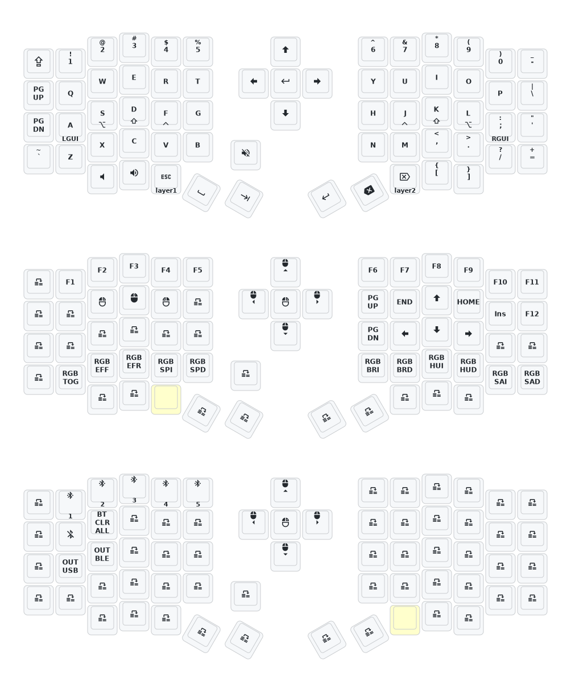

- [English](README.md)

# Eyelash Sofle Keymap with Home Row Mods



GASC Home Row Mods based on [jamiethemorris's home row mods](https://github.com/jamiethemorris/zmk-config/blob/master/config/sofle.keymap)

From [eyelash_sofle.keymap](https://github.com/color00/zmk-sofle/blob/main/config/eyelash_sofle.keymap)
```
behaviors {
    hrm: home_row_mod {
        compatible = "zmk,behavior-hold-tap";
        label = "HOME_ROW_MOD";
        #binding-cells = <2>;
        flavor = "tap-preferred";
        tapping-term-ms = <200>;
        quick-tap-ms = <175>;
        require-prior-idle-ms = <150>;
        global-quick-tap;
        bindings = <&kp>, <&kp>;
    };        
};
```

Left:
```
&hrm LGUI A    &hrm LALT S   &hrm LSHIFT D   &hrm LCTRL F
```

Right:
```
&hrm RCTRL J    &hrm RSHIFT K  &hrm RALT L   &hrm RGUI SEMI
```
